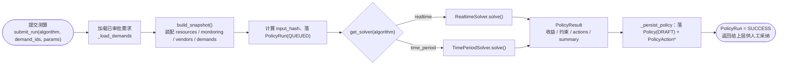
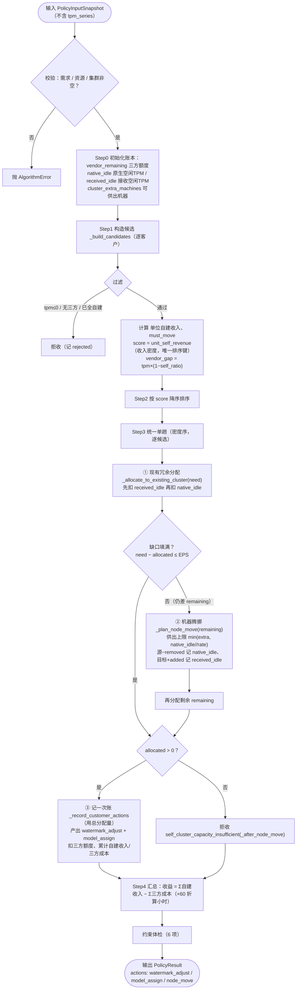
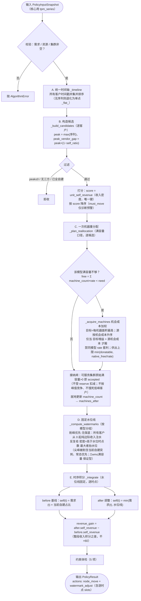

# kongming 调度算法说明：`realtime` 与 `time_period`

> 面向读者：算法/后端/产品。目标是把两个求解器（solver）从**输入 → 运算逻辑 → 约束条件 → 输出**讲清楚。
> 代码位置：[backend/app/algorithms/](../backend/app/algorithms/)
> - 共享经济学与集群物理规则：[_shared.py](../backend/app/algorithms/_shared.py)（`SolverEconomicsMixin`）
> - 数据结构：[base.py](../backend/app/algorithms/base.py)
> - 实时算法：[realtime_solver.py](../backend/app/algorithms/realtime_solver.py)（`RealtimeSolver`）
> - 时段算法：[time_period_solver.py](../backend/app/algorithms/time_period_solver.py)（`TimePeriodSolver`）
> - 注册与调用：[__init__.py](../backend/app/algorithms/__init__.py)、[policy_service.py](../backend/app/services/policy_service.py)

---

## 0. 业务背景与一句话定位

这是一个 **AI 网关**的流量调度平台。客户的 token 业务量（TPM = tokens per minute）可以由两种资源承接：

- **自建集群（self）**：我们自己的 GPU 机器。边际成本 ≈ 0，承接得越多、赚得越多，但**容量有限**。
- **三方供应商（vendor）**：外部 API 兜底。有采购成本，容量按额度（quota）供应，作为自建放不下时的溢出承接。

两个算法解决的是同一个核心问题：**在自建容量 + 三方兜底的约束下，把高收益客户流量尽量搬到自建，最大化自建承接收益。** 区别在时间尺度：

| | `realtime` 实时算法 | `time_period` 时段算法 |
|---|---|---|
| 时间视角 | **某一时刻的快照**（分钟级） | **一整段时间的业务量曲线**（如 24 个整点） |
| 自建容量口径 | 集群当前**冗余** TPM（`current_redundant_tpm`） | 集群**满容量**（`machine_count × tpm_per_machine`），按**峰值**定容 |
| 机器调整 | 把闲置机器**临时腾挪**补冗余 | **一次性**重分配机器，全时段固定 |
| 水位线（自建 TPM 上限） | 每次分配即时确定 | 机器调整后**一次性设定、此后不随时间变化** |
| 收益口径 | 单点收益 × 60（折算到小时） | 调整前后**整段收入积分之差** |
| 机器总量 | 守恒（只挪闲置机器） | 守恒（只在集群间重分配，不新增） |

### 0.1 系统调用链路（两算法共用）

从一次测算请求到落库，两个算法共用同一条流水线，仅在 `get_solver(algorithm)` 处分流：



> 求解器是**纯函数式**的：输入 `PolicyInputSnapshot`、输出 `PolicyResult`，不触库、不产生副作用。落库与状态流转由 [policy_service.py](../backend/app/services/policy_service.py) 负责。算法失败抛 `AlgorithmError` → `PolicyRun` 置 `FAILED`。

---

## 1. 共享基础（两算法通用）

### 1.1 输入数据结构

所有输入被打包进一个 `PolicyInputSnapshot`（[base.py](../backend/app/algorithms/base.py)），由 [snapshot.py](../backend/app/algorithms/snapshot.py) 的 `build_snapshot()` 从资源/监控/供应商三个 client 组装。字段：

**`PolicyInputSnapshot`**

| 字段 | 含义 |
|---|---|
| `demands` | 客户需求列表 `list[DemandSnapshotItem]` |
| `resources` | `{"clusters": [...]}` 自建集群资源快照 |
| `vendors` | 三方供应商额度/报价列表 `list[dict]` |
| `params` | 参数，主要含 `model_prices`（各模型列表价） |
| `monitoring` | 监控快照（当前算法未直接使用其数值） |
| `captured_at` / `algorithm` | 快照时间 / 算法名 |

**`DemandSnapshotItem`（单个客户需求）**

| 字段 | 含义 |
|---|---|
| `report_id` | 需求唯一标识 |
| `customer_code` | 客户编码（专属集群匹配用） |
| `model_name` | 客户使用的模型 |
| `expected_tpm` | 预期业务量（tokens/min）；时段算法里作为峰值基准 |
| `discount_rate` | **售卖折扣**（我们卖给客户打的折，如 0.8） |
| `input_ratio` | **输入:输出 token 比值**（如 3 表示 3:1）；输出基准恒为 1，故无独立 `output_ratio`。算加权列表价用 |
| `cache_hit_rate` | 缓存命中率（命中价更低） |
| `current_self_ratio` | 当前已在自建承接的比例 |
| `current_vendor_ratios` | 当前各三方承接比例 |
| `quality_score` | 客户质量分（当前算法**不参与排序**，保留字段备用） |
| `tpm_series` | `[(时间戳, tpm), ...]` 时段业务量曲线。**仅 `time_period` 使用**；为空则退化为 `expected_tpm` 平序列。`realtime` 忽略此字段 |

**集群资源项（`resources["clusters"]` 每个元素）** — 关键字段：

| 字段 | 含义 |
|---|---|
| `cluster_name` | 集群名（含 `KSCC`/`XISHANJU` 视为**专属集群**） |
| `deployed_model` | 该集群部署的模型（决定能服务哪些需求） |
| `primary_customer` | 专属客户（专属集群只服务它） |
| `machine_count` | 机器台数 |
| `tpm_per_machine` | 单机产能（tokens/min） |
| `current_redundant_tpm` | 当前**空闲** TPM（realtime 的容量口径）= 总容量 − 当前自建负载。是**原始当前空闲**，**未**假设三方流量已回收；回收三方到自建会消耗它 |
| `current_redundant_machines` / `busy_redundant_machines` | 当前空闲机器数（可供出机器口径），同为“原生当前空闲”，与 `current_redundant_tpm` 对应 |

**三方供应商项（`vendors` 每个元素）**

| 字段 | 含义 |
|---|---|
| `vendor` | 供应商名 |
| `model` | 供应的模型 |
| `quota_tpm` | 可用额度（TPM） |
| `unit_cost` | **采购成本**（我们付给三方，每 token） |
| `unit_price` | 三方对应的列表价（用于算采购折扣） |

### 1.2 共享经济学口径（`SolverEconomicsMixin`）

两个算法继承同一个 Mixin（[_shared.py](../backend/app/algorithms/_shared.py)），保证口径一致：

**① 单位自建收入（收入密度）`_unit_self_revenue`** —— 排序的核心指标：

```
输入占比 = io/(io+1)，输出占比 = 1/(io+1)   # io = input_ratio（输入:输出比值）
加权列表价 = 输入占比 × [命中率 × 命中价 + (1-命中率) × 未命中价] + 输出占比 × 输出价
单位自建收入 = 加权列表价 × 售卖折扣(discount_rate)
```
其中 `input_ratio` 是「输入:输出」token 比值（输出基准恒为 1），`io<=0` 时退化为 1:1（占比各 0.5）；若模型无 `model_prices` 配置，用三方 `unit_price` 兜底（命中价默认按 `unit_price × 0.2`）。这个值代表**每单位 TPM 放到自建能赚的钱**（自建边际成本≈0，故约等于净收益密度）。

**② 最优三方 `_best_vendor`**：在 `model==客户模型 且 quota_tpm>0` 的供应商里，取 `unit_cost` **最低**者作为兜底。找不到 → 拒收 `vendor_capacity_or_model_unavailable`。

**③ 采购折扣 `_purchase_discount`** = `vendor.unit_cost / vendor.unit_price`。
> **`must_move` 判定**：若 `客户售卖折扣 ≤ 采购折扣`，意味着这部分留在三方是**亏钱**的（卖价 ≤ 进价）。这类客户**不再参与排序置顶**，仅在 `diagnostics.must_move_customers` 中标记为**预警**，供人工决定是否手动全挪自建止损。

**④ 集群物理规则**

- `_matching_clusters(model, clusters, customer_code)`：筛出 `deployed_model==model` 的集群；**专属集群**（名字含 `KSCC`/`XISHANJU`）只有当 `primary_customer==该客户` 时才可用，否则不进共享池。
- `_min_reserve_machines`：`KSCC` 集群常态**最少保留 2 台**。
- `_donatable_machines`：可供出机器 = `min(空闲机器数, 总机器 − 最小保留)`，且 ≥0。

---

## 2. `realtime` 实时算法

**定位**：分钟级实时调度。看**某一时刻**的需求与集群冗余，在自建冗余容量 + 三方兜底下，把高收益客户流量搬到自建，最大化单点自建收益。

### 2.1 输入

- `snapshot.demands`：客户需求（**不使用** `tpm_series`，只用 `expected_tpm` 等标量）。
- `snapshot.resources["clusters"]`：自建集群，容量口径为 `current_redundant_tpm`（当前冗余）。
- `snapshot.vendors`：三方额度与报价。
- `snapshot.params["model_prices"]`：模型列表价。

前置校验（任一不满足抛 `AlgorithmError`）：需求非空、资源与三方数据存在、集群列表非空。

### 2.2 运算逻辑（流程图）



### 2.3 运算逻辑（分步详解）

**Step 0 — 初始化可变账本**
- `vendor_remaining`：各三方剩余额度（键 = `vendor::model`）。
- `native_idle`：各集群**原生**空闲 TPM（初值 = `current_redundant_tpm`）。可被分配消耗，也可**背书供出机器**。
- `received_idle`：各集群**接收**到的机器带来的 TPM（初值 0）。只能被分配消耗，**永不背书供出**——杜绝“原生冗余被吃空后靠接收余量供出已占用机器”的容量重复占用。
- `cluster_extra_machines`：各集群可供出机器数（`_donatable_machines`）。

**Step 1 — 构造候选 `_build_candidates`**（逐个客户）：
1. `expected_tpm ≤ 0` → 拒收 `non_positive_tpm`。
2. 计算 `unit_self_revenue`；找 `best_vendor`，无 → 拒收 `vendor_capacity_or_model_unavailable`。
3. 计算 `must_move`（售卖折扣 ≤ 采购折扣）——**仅作诊断预警**，不参与排序。
4. `current_vendor_tpm = expected_tpm × (1 − current_self_ratio)`。若 ≤0（已全自建）→ 拒收 `already_fully_self_hosted`。**只回收当前走三方的这部分**，不动已在自建的量。
5. 打分（**密度优先的分数背包**）：
   ```
   score = unit_self_revenue   # 单位自建收入密度，唯一排序键
   ```
   `vendor_gap_tpm = current_vendor_tpm`（可回收到自建的量）。

**Step 2 — 按 score 降序排序**（纯按收入密度；`must_move`/质量分不参与排序，`must_move` 客户改由 `diagnostics.must_move_customers` 预警）。

**Step 3 — 统一单趟（密度序，逐候选）**
按 `score`（收入密度）降序遍历候选，每个客户在**自己这一轮内**依次完成「现有冗余分配 → 不足则腾挪补齐 → 记一次账」，从而保证**高密度客户先于低密度客户占用/腾挪同一集群容量**，且**部分承接的高密度客户会立刻用腾挪补齐**（不再像旧两趟那样停在 partial 或被低密度客户倒挂）。

**① 现有冗余分配** `_allocate_to_existing_cluster(candidate, …, need)`
从其可服务集群里取 `min(剩余需求, native_idle + received_idle)`，**先扣 `received_idle` 再扣 `native_idle`**（接收机器锁定在本集群、优先用掉，把原生机器尽量留作可供出），累计 `allocated`。首次 `need = vendor_gap_tpm`。

**② 机器腾挪补容量** `_plan_node_move(candidate, …, need=remaining)`（当 `need − allocated > EPS`）
从别的集群把**闲置机器**挪到目标集群：
- **目标** = 该客户可服务集群里 `tpm_per_machine` 最高者。
- **源** = 其他集群中：可供出机器>0、单机产能>0，按可供出机器数降序。
- 跨多个源累积腾挪直到覆盖 `remaining`；每个源真正能搬的机器数受其**原生**空闲 TPM 限制：`movable = min(可供出机器, ⌊native_idle/源单机产能⌋)`，`machines = min(movable, ⌈缺口/目标单机产能⌉)`。
- **产能非对称计入**（关键）：机器搬到目标集群要按目标模型重部署 ——
  ```
  目标集群新增产能 = machines × 目标单机产能(added_tpm)  → 记入目标 received_idle
  源集群失去产能   = machines × 源单机产能(removed_tpm)   → 从源 native_idle 扣减
  ```
- **无需“禁止倒手”互斥**：接收得到的产能只进 `received_idle`、永不背书供出（供出上限只看 `native_idle`），故 A→B→C 的真 relay 结构上不可能；一个集群**既供出又接收**（A→B & C→A）是安全的、被允许。
- 腾挪后再次 `_allocate_to_existing_cluster(need=remaining)` 吃下新增容量。全程分不到 → 拒收 `self_cluster_capacity_insufficient(_after_node_move)`；分到部分 → 记 partial（残余走三方）。

**③ 记账 `_record_customer_actions`**（每候选**只记一次**，用总分配量 `allocated`）：
```
目标自建比例   = min(1, current_self_ratio + allocated / expected_tpm)
目标自建TPM    = expected_tpm × 目标自建比例
剩余三方TPM    = expected_tpm − 目标自建TPM
自建收入       = allocated × 单位自建收入 × 60      # ×60：分钟→小时折算
三方成本       = 剩余三方TPM × vendor.unit_cost × 60
本单预期收益   = 自建收入 − 三方成本
```
扣减 `vendor_remaining`，产出两个 action：`watermark_adjust`（水位线：自建占比 `from_self_ratio`→`to_self_ratio`）和 `model_assign`（模型指派）。

**Step 4 — 汇总收益**：`expected_revenue_gain = Σ自建收入 − Σ三方成本`。

### 2.4 约束条件（`_build_constraints`，输出到 `constraints`）

| 约束 | 命中(hit)含义 |
|---|---|
| `vendor_capacity_sufficient` | 无因三方不可用被拒 **且** 所有三方剩余额度 ≥0（水位调整后三方能兜住未迁移流量） |
| `vendor_margin_positive` | 存在候选且未因三方毛利不正被拒（售卖折扣 > 采购折扣、毛利为正） |
| `self_cluster_capacity_sufficient` | 无客户因自建容量不足被拒 |
| `model_match_satisfied` | 客户模型能匹配到自建集群/三方 |
| `node_move_feasible` | 容量不足时能给出可执行的腾挪方案（无 `..._after_node_move` 拒因） |
| `positive_revenue_gain` | `expected_revenue_gain > 0` |

> 隐含硬约束（体现在流程里，而非仅体检项）：只回收三方部分不超配冗余、专属集群限定、KSCC 最小保留、机器腾挪总量守恒、原生/接收冗余分账（供出只背书原生、杜绝容量重复占用）、三方额度不透支。

### 2.5 输出（`PolicyResult`）

- `expected_revenue_gain` / `expected_peak_shaving_gain`（= 收益）/ `expected_off_peak_gain`（=0）
- `constraints`：上表 6 项体检。
- `actions`：`watermark_adjust`、`model_assign`、`node_move` 三类草案（含 `expected_gain`）。
- `diagnostics`：`candidate_count`、`rejected`（含拒因）、`cluster_remaining_tpm`、`vendor_remaining_tpm`。
- `summary`：`accepted_customers`（客户、增量自建 TPM、单位收入、兜底三方）、`total_self_tpm_added`、`expected_self_revenue`、`expected_vendor_cost`、`node_moves`、`watermark_changes`。

---

## 3. `time_period` 时段算法

**定位**：看**一整段时间**的拟合业务量曲线，做**一次**机器重分配 + 设定**固定水位线**，最大化自建集群整段的**收入积分**。机器只调一次、全时段固定、按**峰值**定容；机器总量守恒。

### 3.1 输入

与 realtime 相同的 snapshot，但**核心多用 `tpm_series`**（客户日内业务量曲线，如 24 个整点）。集群容量口径改为**满容量** `machine_count × tpm_per_machine`（不是冗余）。前置校验同 realtime。

> 真实运行中 `tpm_series` 由外部合成/拟合（示例见 [run_time_period_on_testdata.py](../run_time_period_on_testdata.py)：以 Excel 的 TPM 为峰值基准，叠加日内 9–21 点高、夜间低的曲线生成 24 点）。

### 3.2 运算逻辑（流程图）



> **占比随时间变的本质**：水位线固定，只有 `需求(t)` 在变。低谷时需求 < 水位线 → 自建占比≈100%；峰值时需求 > 水位线 → 超出部分溢出到三方。

### 3.3 运算逻辑（分步详解）

**Step A — 统一时间轴 `_timeline`**：所有客户 `tpm_series` 时间戳的**并集**并排序；都没有序列则退化为单点 `["_flat_"]`。`_series_of` 把每个客户对齐到该时间轴（缺失点补 0；无序列则用 `expected_tpm` 铺平）。

**Step B — 构造候选 `_build_candidates`**（逐客户）：
1. `peak = max(series)`；`peak ≤ 0` → 拒 `non_positive_tpm`。
2. `best_vendor` 无 → 拒 `vendor_capacity_or_model_unavailable`。
3. `peak_vendor_gap = peak × (1 − current_self_ratio)`（峰值处待回收的三方量）；≤0 → 拒 `already_fully_self_hosted`。
4. 打分同 realtime：`score = unit_self_revenue`（收入密度，唯一键）。按 score 降序；`must_move` 仅作诊断预警。

**Step C — 一次机器重分配 `_plan_reallocation`**（**满容量口径**，与 Step D 一致，总量守恒）：
- **两套账本分离**：`full_avail[集群] = machine_count×rate`（**规划口径**，与 Step D 相同——决定"是否要搬机器"与后续客户可用容量，随搬运源 −removed/目标 +added、`_reserve` 逐簇 clamp 扣减）；`native_free[集群] = current_redundant_tpm`（**物理护栏**——只作 `_acquire_machines` 的供出上限 `min(donatable, ⌊native_free/源速率⌋)`，保证只搬**真正空闲**的机器；只被搬运递减、接收不递增、reserve 不碰 → 恒 ≥0，且"接收的机器不进 native_free 就无法再供出"天然防 relay）。
- 逐候选（收入密度序）：
  - `servable` = 可服务集群；无 → 拒 `no_servable_cluster`。
  - `free = Σ full_avail[servable]`（满容量口径）；`need = peak_vendor_gap`；**仅当 `need − free > EPS`（该模型满容量真的不够）才 `_acquire_machines` 搬机器**——消除"`current_redundant=0` 却满容量够时的误导性/幻影搬运"。
  - **接纳闸**：可服务集群**原始满容量** `Σ machine_count×rate > 0`（搬运后、**不受 reserve 扣减**）即计入 `accepted`；真实自建量由 Step D 决定（不按峰值竞争，避免饿死低峰客户）。
  - `_reserve`：从 `full_avail` 逐簇扣 `min(need, free)`，供后续客户的移动触发 free 计算。
- **`_acquire_machines`（机会成本 + 每机器面积）**：**每机器面积** = `密度 × Σ_t min(rate, 需求(t))`。目标取"加一台机器每机器面积最高"的可服务集群；源按**机会成本**（该机器留在源集群、服务源自身可服务客户的最高每机器面积）从低到高选；仅当**目标增益 > 源机会成本**才搬。
  - **禁止"同模型 rate 套利"**：源筛选排除"源与目标同模型 且 源速率 < 目标速率"——把 50k 机器搬到 80k 同模型集群按 80k 计产能会**凭空抬高总容量（幻影）**；同模型=同吞吐，rate 差是硬件差、不可随重部署转移。**保留**：跨模型搬运（重部署为目标模型，P1 按目标能力可辩护）、同模型降速率搬运（如专属集群 KSCC→共享 GLM-main，把机器搬到客户能用处）。
  - **无需 donor/receiver 互斥**：接收的机器不进 native_free 就无法再供出，真 relay 结构上不可能。
- 输出 `node_moves`、`accepted`，并就地改好 `clusters` 的 `machine_count`（→ `machines_after`）。

**Step D — 固定水位线 `_compute_watermarks`**（机器调整后一次性设定，此后不变）：
按模型分组，每组：
1. `cluster_cap` = 各集群**调整后**满容量。
2. **削峰优先·无保底**：所有客户水位 `level` 从 **0** 起。当前自建与待回收三方**一视同仁**——不预留"当前自建量"，故**突刺形状的当前自建也会被削峰**（其突刺部分挖回三方），把有限容量投到收入最高处。
3. **纯边际收入注水**：目标是最大化整段自建**收入** `Σ_t Σ_i min(需求_i(t), wm_i) × 密度_i`。反复挑“抬高水位线的**边际收入**最大”的客户，把它的水位抬到下一个 breakpoint：
   ```
   边际收入 = 密度 × |{t : 需求(t) > 当前水位}|     # 密度已在其中；= 密度 × 高于当前水位的时点数
   ```
   直觉：**尖峰**（高、窄，时点少）边际收入低 → 被削到低水位；**常态**（矮、宽，时点多）边际收入高 → 优先注满。断点离散化：候选水位 = 该客户序列里 distinct tpm 值，两断点间边际收入恒定。单一容量池下该贪心 = 收入面积全局最优（凹性）。
4. `watermark[客户] = 注水结果`（**固定自建 TPM 上限**，∈[0, 自身峰值]）。**保证型不过订**：每次注水经 `_draw` 扣 `cluster_cap`，`Σwm ≤ Σ满容量` 恒成立 ⇒ 任一时点 `Σ min(需求,wm) ≤ Σwm ≤ Σcap`。
5. **返回 `(watermarks, kept)`**：kept = 实际拿到自建容量（wm>0）的客户，供摘要展示；**before/after 积分对全体候选**（wm=0 的被削客户 after 自建=0、before=当前自建），故"当前自建被削峰挖回三方"的损失正确计入 `gain`，不虚高，并对其生成"撤出自建"的 watermark 变更。

**Step E — 时序积分 `_integrate`**（水位线固定，跑量随时间变）：
逐客户、逐时点：
```
adjust=True （调整后）：self(t) = min(需求(t), 水位线)
adjust=False（调整前基线）：self(t) = 需求(t) × current_self_ratio
vendor(t) = 需求(t) − self(t)
self_revenue += self(t) × 单位自建收入        # 沿时间轴累加 = 收入积分
```
> 注意：**自建占比随时间变化**并非因为水位线动，而是水位线固定、只有 `需求(t)` 在变 —— 低谷时需求低于水位线，自建占比接近 100%；峰值时需求超过水位线，超出部分溢出到三方。
> `revenue_gain = after.self_revenue − before.self_revenue`（整段收入积分之差；此处**不 ×60**，是沿时间轴的积分求和）。

### 3.4 约束条件（`_build_constraints`）

| 约束 | 命中含义 |
|---|---|
| `peak_capacity_sufficient` | 无客户因自建容量不足被拒（自建已按峰值定容，峰值需求可被自建+三方覆盖） |
| `vendor_margin_positive` | 存在候选（三方承接部分售卖折扣 > 采购折扣） |
| `high_value_moved_to_self` | 至少有优质客户被挪到自建承接（`len(accepted) > 0`） |
| `machines_conserved` | `Σmachines_before == Σmachines_after`（机器总量守恒） |
| `positive_revenue_gain` | `revenue_gain > 0` |

### 3.5 输出（`PolicyResult`）

- `expected_revenue_gain` / `expected_peak_shaving_gain`（= 收益）/ `expected_off_peak_gain`（=0）
- `constraints`：上表 5 项。
- `actions`：`node_move`（机器腾挪）+ `watermark_adjust`（每客户固定水位线，payload 含逐时点 `slots`：`ts / tpm / self_ratio / self_tpm / vendor_tpm`）。
- `diagnostics`：`timeline_points`、`candidate_count`、`rejected`、`machines_before`、`machines_after`、`model_self_capacity`。
- `summary`：`accepted_customers`、`node_moves`、`watermark_changes`（含 slots）、`self_revenue_before/after`、`expected_revenue_gain`、`self_tpm_integral_before/after`、`machines_total_before/after`。

---

## 4. 两算法对照速查

| 维度 | `realtime` | `time_period` |
|---|---|---|
| **输入焦点** | 单点标量（`expected_tpm`、冗余 TPM） | 时序曲线（`tpm_series`）、满容量 |
| **自建容量** | `current_redundant_tpm`（冗余） | `machine_count × tpm_per_machine`（满容量；水位线按边际收入注水、削峰优先） |
| **可回收量** | `expected_tpm × (1−self_ratio)` | `peak × (1−self_ratio)`（峰值口径） |
| **排序键** | 收入密度（`unit_self_revenue`，唯一）；must_move 仅诊断预警 | 同左 |
| **机器调整** | 统一单趟内临时腾挪补冗余；原生/接收冗余分账，允许集群既供又收（A→B & C→A） | 一次重分配、全时段固定；原生/接收冗余分账，同样允许 A→B & C→A |
| **水位线** | 每次分配即时确定 | 一次性设定，时段内固定 |
| **收益口径** | 单点：`Σ(自建收入−三方成本)`，×60 折算小时 | 整段：`after − before` 收入积分（不 ×60） |
| **机器守恒** | 是（挪闲置机器） | 是（集群间重分配） |
| **专属集群/KSCC 保留** | 遵守 | 遵守 |
| **动作类型** | `watermark_adjust`+`model_assign`+`node_move` | `node_move`+`watermark_adjust`(带 slots) |
| **典型场景** | “此刻”实时调度，快速止损/抢收益 | 制定一整天的固定调度方案 |

### 共同的设计原则（两算法一致）
1. **收入密度优先的分数背包**：自建 TPM 有限、机器成本固定时，最大化自建收入 = 按“单位 TPM 自建收入”从高到低填满容量。
2. **must_move 亏损预警**：售卖折扣 ≤ 采购折扣的客户留在三方是亏的。此标记**不再影响排序**，仅写入 `diagnostics.must_move_customers` 供人工关注是否手动全挪自建止损。
3. **只回收三方部分**：不动已在自建的量，不超配容量、不虚增收益。
4. **机器总量守恒 + 原生/接收冗余分账**：机器只在集群间搬、不新增。两算法**均**采用分账防倒手/重复占用——接收得到的产能只进 `received`（`received_idle` / `received_free`）、永不背书供出，供出上限只看 `native`（`native_idle` / `native_free`）；真 relay 结构上不可能，故**均允许**集群既供又收（A→B & C→A）。分账同时杜绝“同一份容量既算可分配又算腾挪新增”的双重计数。
5. **产能非对称计入**：机器搬到目标集群按目标模型单机能力计新增，源集群按自身单机能力计释放。
6. **专属集群与最小保留**：`KSCC`/`XISHANJU` 只服务对应客户；`KSCC` 至少保留 2 台。
